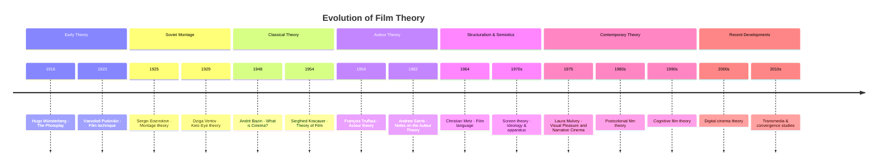

```mermaid
timeline
    title Evolution of Film Theory
    section Early Theory
        1916 : Hugo Münsterberg - The Photoplay
        1923 : Vsevolod Pudovkin - Film technique
    section Soviet Montage
        1925 : Sergei Eisenstein - Montage theory
        1929 : Dziga Vertov - Kino-Eye theory
    section Classical Theory
        1948 : André Bazin - What is Cinema?
        1954 : Siegfried Kracauer - Theory of Film
    section Auteur Theory
        1954 : François Truffaut - Auteur theory
        1962 : Andrew Sarris - Notes on the Auteur Theory
    section Structuralism & Semiotics
        1964 : Christian Metz - Film language
        1970s : Screen theory - Ideology & apparatus
    section Contemporary Theory
        1975 : Laura Mulvey - Visual Pleasure and Narrative Cinema
        1980s : Postcolonial film theory
        1990s : Cognitive film theory
    section Recent Developments
        2000s : Digital cinema theory
        2010s : Transmedia & convergence studies
```
