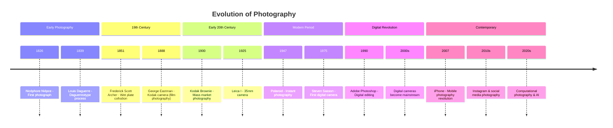

```mermaid
timeline
    title Evolution of Photography
    section Early Photography
        1826 : Nicéphore Niépce - First photograph
        1839 : Louis Daguerre - Daguerreotype process
    section 19th Century
        1851 : Frederick Scott Archer - Wet plate collodion
        1888 : George Eastman - Kodak camera (film photography)
    section Early 20th Century
        1900 : Kodak Brownie - Mass market photography
        1925 : Leica I - 35mm camera
    section Modern Period
        1947 : Polaroid - Instant photography
        1975 : Steven Sasson - First digital camera
    section Digital Revolution
        1990 : Adobe Photoshop - Digital editing
        2000s : Digital cameras become mainstream
    section Contemporary
        2007 : iPhone - Mobile photography revolution
        2010s : Instagram & social media photography
        2020s : Computational photography & AI
```
