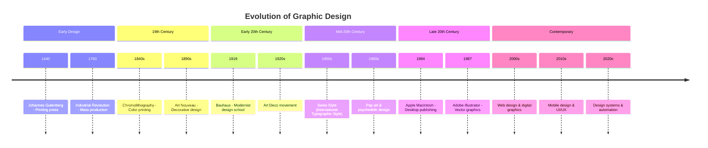

```mermaid
timeline
    title Evolution of Graphic Design
    section Early Design
        1440 : Johannes Gutenberg - Printing press
        1760 : Industrial Revolution - Mass production
    section 19th Century
        1840s : Chromolithography - Color printing
        1890s : Art Nouveau - Decorative design
    section Early 20th Century
        1919 : Bauhaus - Modernist design school
        1920s : Art Deco movement
    section Mid-20th Century
        1950s : Swiss Style (International Typographic Style)
        1960s : Pop art & psychedelic design
    section Late 20th Century
        1984 : Apple Macintosh - Desktop publishing
        1987 : Adobe Illustrator - Vector graphics
    section Contemporary
        2000s : Web design & digital graphics
        2010s : Mobile design & UI/UX
        2020s : Design systems & automation
```
