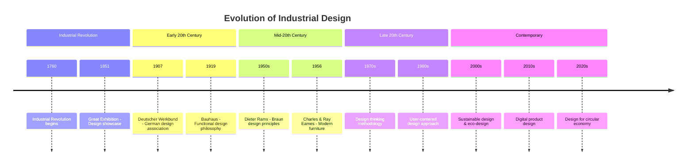

```mermaid
timeline
    title Evolution of Industrial Design
    section Industrial Revolution
        1760 : Industrial Revolution begins
        1851 : Great Exhibition - Design showcase
    section Early 20th Century
        1907 : Deutscher Werkbund - German design association
        1919 : Bauhaus - Functional design philosophy
    section Mid-20th Century
        1950s : Dieter Rams - Braun design principles
        1956 : Charles & Ray Eames - Modern furniture
    section Late 20th Century
        1970s : Design thinking methodology
        1980s : User-centered design approach
    section Contemporary
        2000s : Sustainable design & eco-design
        2010s : Digital product design
        2020s : Design for circular economy
```
