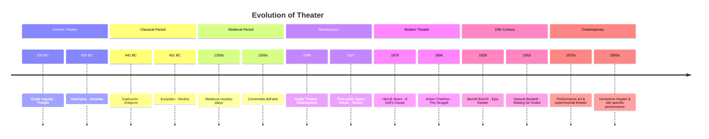

```mermaid
timeline
    title Evolution of Theater
    section Ancient Theater
        534 BC : Greek tragedy - Thespis
        458 BC : Aeschylus - Oresteia
    section Classical Period
        441 BC : Sophocles - Antigone
        431 BC : Euripides - Medea
    section Medieval Period
        1200s : Medieval mystery plays
        1500s : Commedia dell'arte
    section Renaissance
        1599 : Globe Theatre - Shakespeare
        1637 : First public opera house - Venice
    section Modern Theater
        1879 : Henrik Ibsen - A Doll's House
        1896 : Anton Chekhov - The Seagull
    section 20th Century
        1928 : Bertolt Brecht - Epic theater
        1953 : Samuel Beckett - Waiting for Godot
    section Contemporary
        1970s : Performance art & experimental theater
        2000s : Immersive theater & site-specific performance
```
