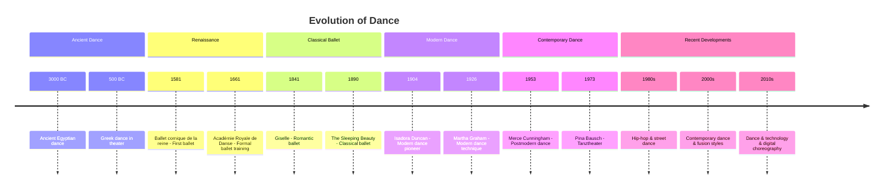

```mermaid
timeline
    title Evolution of Dance
    section Ancient Dance
        3000 BC : Ancient Egyptian dance
        500 BC : Greek dance in theater
    section Renaissance
        1581 : Ballet comique de la reine - First ballet
        1661 : Académie Royale de Danse - Formal ballet training
    section Classical Ballet
        1841 : Giselle - Romantic ballet
        1890 : The Sleeping Beauty - Classical ballet
    section Modern Dance
        1904 : Isadora Duncan - Modern dance pioneer
        1926 : Martha Graham - Modern dance technique
    section Contemporary Dance
        1953 : Merce Cunningham - Postmodern dance
        1973 : Pina Bausch - Tanztheater
    section Recent Developments
        1980s : Hip-hop & street dance
        2000s : Contemporary dance & fusion styles
        2010s : Dance & technology & digital choreography
```
