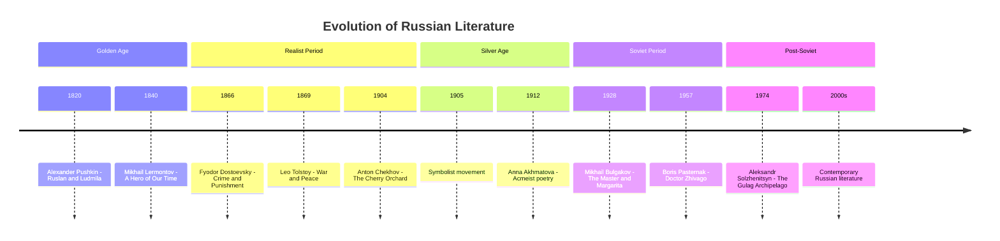

```mermaid
timeline
    title Evolution of Russian Literature
    section Golden Age
        1820 : Alexander Pushkin - Ruslan and Ludmila
        1840 : Mikhail Lermontov - A Hero of Our Time
    section Realist Period
        1866 : Fyodor Dostoevsky - Crime and Punishment
        1869 : Leo Tolstoy - War and Peace
        1904 : Anton Chekhov - The Cherry Orchard
    section Silver Age
        1905 : Symbolist movement
        1912 : Anna Akhmatova - Acmeist poetry
    section Soviet Period
        1928 : Mikhail Bulgakov - The Master and Margarita
        1957 : Boris Pasternak - Doctor Zhivago
    section Post-Soviet
        1974 : Aleksandr Solzhenitsyn - The Gulag Archipelago
        2000s : Contemporary Russian literature
```
