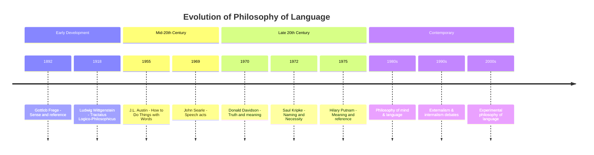

```mermaid
timeline
    title Evolution of Philosophy of Language
    section Early Development
        1892 : Gottlob Frege - Sense and reference
        1918 : Ludwig Wittgenstein - Tractatus Logico-Philosophicus
    section Mid-20th Century
        1955 : J.L. Austin - How to Do Things with Words
        1969 : John Searle - Speech acts
    section Late 20th Century
        1970 : Donald Davidson - Truth and meaning
        1972 : Saul Kripke - Naming and Necessity
        1975 : Hilary Putnam - Meaning and reference
    section Contemporary
        1980s : Philosophy of mind & language
        1990s : Externalism & internalism debates
        2000s : Experimental philosophy of language
```
