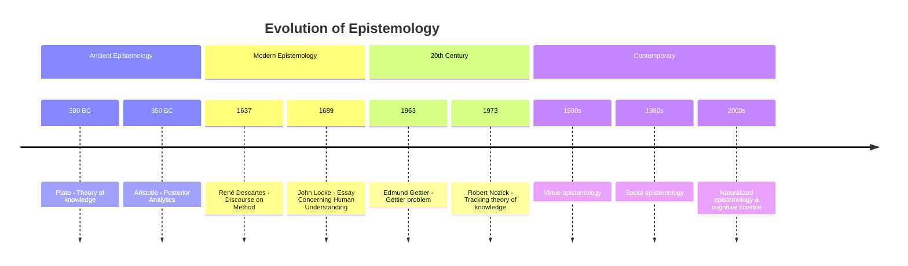

```mermaid
timeline
    title Evolution of Epistemology
    section Ancient Epistemology
        380 BC : Plato - Theory of knowledge
        350 BC : Aristotle - Posterior Analytics
    section Modern Epistemology
        1637 : René Descartes - Discourse on Method
        1689 : John Locke - Essay Concerning Human Understanding
    section 20th Century
        1963 : Edmund Gettier - Gettier problem
        1973 : Robert Nozick - Tracking theory of knowledge
    section Contemporary
        1980s : Virtue epistemology
        1990s : Social epistemology
        2000s : Naturalized epistemology & cognitive science
```
