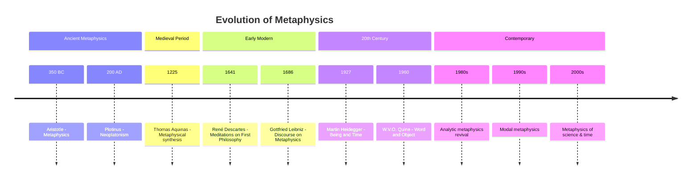

```mermaid
timeline
    title Evolution of Metaphysics
    section Ancient Metaphysics
        350 BC : Aristotle - Metaphysics
        200 AD : Plotinus - Neoplatonism
    section Medieval Period
        1225 : Thomas Aquinas - Metaphysical synthesis
    section Early Modern
        1641 : René Descartes - Meditations on First Philosophy
        1686 : Gottfried Leibniz - Discourse on Metaphysics
    section 20th Century
        1927 : Martin Heidegger - Being and Time
        1960 : W.V.O. Quine - Word and Object
    section Contemporary
        1980s : Analytic metaphysics revival
        1990s : Modal metaphysics
        2000s : Metaphysics of science & time
```
