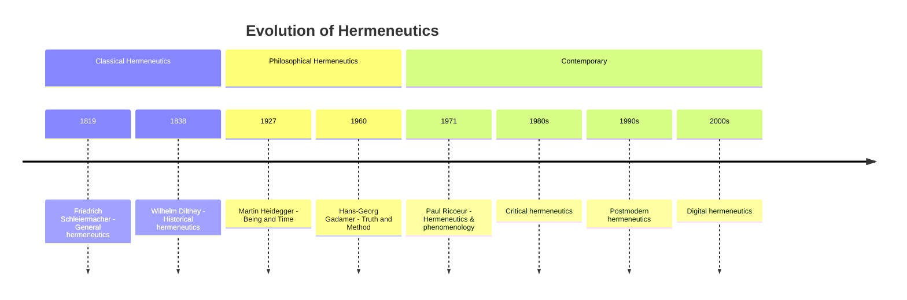

```mermaid
timeline
    title Evolution of Hermeneutics
    section Classical Hermeneutics
        1819 : Friedrich Schleiermacher - General hermeneutics
        1838 : Wilhelm Dilthey - Historical hermeneutics
    section Philosophical Hermeneutics
        1927 : Martin Heidegger - Being and Time
        1960 : Hans-Georg Gadamer - Truth and Method
    section Contemporary
        1971 : Paul Ricoeur - Hermeneutics & phenomenology
        1980s : Critical hermeneutics
        1990s : Postmodern hermeneutics
        2000s : Digital hermeneutics
```
