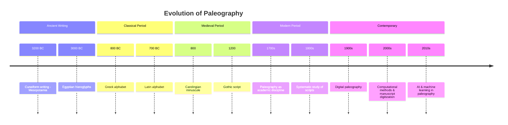

```mermaid
timeline
    title Evolution of Paleography
    section Ancient Writing
        3200 BC : Cuneiform writing - Mesopotamia
        3000 BC : Egyptian hieroglyphs
    section Classical Period
        800 BC : Greek alphabet
        700 BC : Latin alphabet
    section Medieval Period
        800 : Carolingian minuscule
        1200 : Gothic script
    section Modern Period
        1700s : Paleography as academic discipline
        1800s : Systematic study of scripts
    section Contemporary
        1900s : Digital paleography
        2000s : Computational methods & manuscript digitization
        2010s : AI & machine learning in paleography
```
