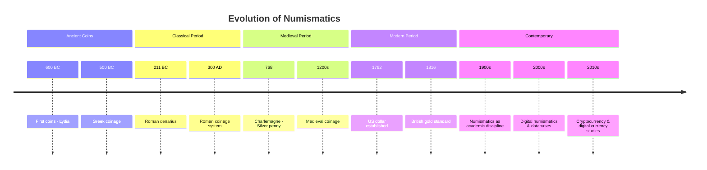

```mermaid
timeline
    title Evolution of Numismatics
    section Ancient Coins
        600 BC : First coins - Lydia
        500 BC : Greek coinage
    section Classical Period
        211 BC : Roman denarius
        300 AD : Roman coinage system
    section Medieval Period
        768 : Charlemagne - Silver penny
        1200s : Medieval coinage
    section Modern Period
        1792 : US dollar established
        1816 : British gold standard
    section Contemporary
        1900s : Numismatics as academic discipline
        2000s : Digital numismatics & databases
        2010s : Cryptocurrency & digital currency studies
```
