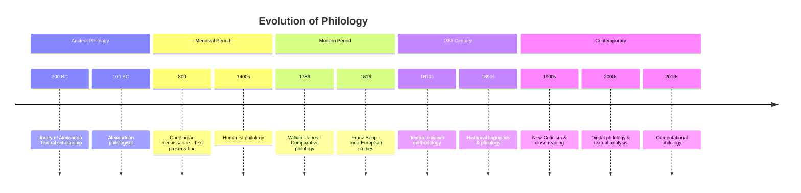

```mermaid
timeline
    title Evolution of Philology
    section Ancient Philology
        300 BC : Library of Alexandria - Textual scholarship
        100 BC : Alexandrian philologists
    section Medieval Period
        800 : Carolingian Renaissance - Text preservation
        1400s : Humanist philology
    section Modern Period
        1786 : William Jones - Comparative philology
        1816 : Franz Bopp - Indo-European studies
    section 19th Century
        1870s : Textual criticism methodology
        1890s : Historical linguistics & philology
    section Contemporary
        1900s : New Criticism & close reading
        2000s : Digital philology & textual analysis
        2010s : Computational philology
```
