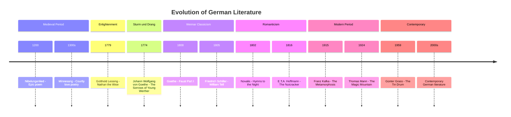

```mermaid
timeline
    title Evolution of German Literature
    section Medieval Period
        1200 : Nibelungenlied - Epic poem
        1300s : Minnesang - Courtly love poetry
    section Enlightenment
        1779 : Gotthold Lessing - Nathan the Wise
    section Sturm und Drang
        1774 : Johann Wolfgang von Goethe - The Sorrows of Young Werther
    section Weimar Classicism
        1808 : Goethe - Faust Part I
        1805 : Friedrich Schiller - William Tell
    section Romanticism
        1802 : Novalis - Hymns to the Night
        1816 : E.T.A. Hoffmann - The Nutcracker
    section Modern Period
        1915 : Franz Kafka - The Metamorphosis
        1924 : Thomas Mann - The Magic Mountain
    section Contemporary
        1959 : Günter Grass - The Tin Drum
        2000s : Contemporary German literature
```
