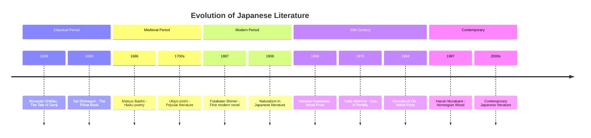

```mermaid
timeline
    title Evolution of Japanese Literature
    section Classical Period
        1008 : Murasaki Shikibu - The Tale of Genji
        1000 : Sei Shōnagon - The Pillow Book
    section Medieval Period
        1686 : Matsuo Bashō - Haiku poetry
        1700s : Ukiyo-zōshi - Popular literature
    section Modern Period
        1887 : Futabatei Shimei - First modern novel
        1906 : Naturalism in Japanese literature
    section 20th Century
        1968 : Yasunari Kawabata - Nobel Prize
        1970 : Yukio Mishima - Sea of Fertility
        1994 : Kenzaburō Ōe - Nobel Prize
    section Contemporary
        1987 : Haruki Murakami - Norwegian Wood
        2000s : Contemporary Japanese literature
```
