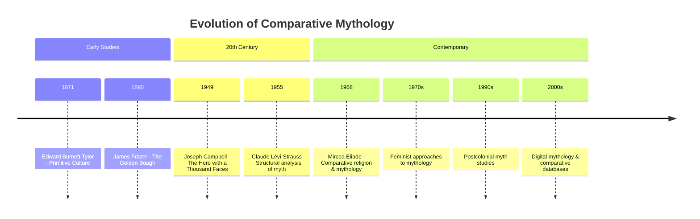

```mermaid
timeline
    title Evolution of Comparative Mythology
    section Early Studies
        1871 : Edward Burnett Tylor - Primitive Culture
        1890 : James Frazer - The Golden Bough
    section 20th Century
        1949 : Joseph Campbell - The Hero with a Thousand Faces
        1955 : Claude Lévi-Strauss - Structural analysis of myth
    section Contemporary
        1968 : Mircea Eliade - Comparative religion & mythology
        1970s : Feminist approaches to mythology
        1990s : Postcolonial myth studies
        2000s : Digital mythology & comparative databases
```
