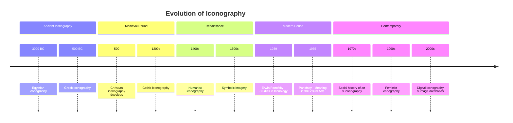

```mermaid
timeline
    title Evolution of Iconography
    section Ancient Iconography
        3000 BC : Egyptian iconography
        500 BC : Greek iconography
    section Medieval Period
        500 : Christian iconography develops
        1200s : Gothic iconography
    section Renaissance
        1400s : Humanist iconography
        1500s : Symbolic imagery
    section Modern Period
        1939 : Erwin Panofsky - Studies in Iconology
        1955 : Panofsky - Meaning in the Visual Arts
    section Contemporary
        1970s : Social history of art & iconography
        1990s : Feminist iconography
        2000s : Digital iconography & image databases
```
