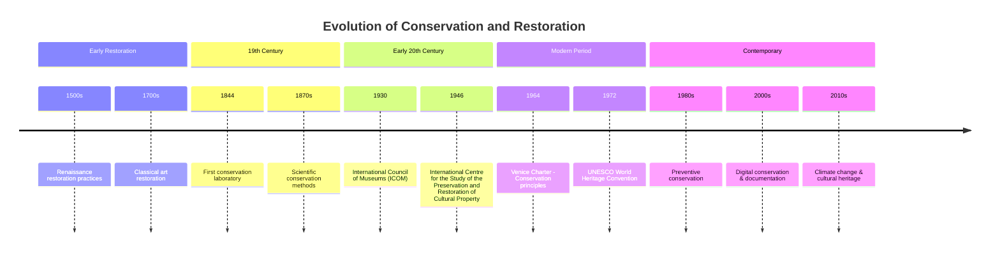

```mermaid
timeline
    title Evolution of Conservation and Restoration
    section Early Restoration
        1500s : Renaissance restoration practices
        1700s : Classical art restoration
    section 19th Century
        1844 : First conservation laboratory
        1870s : Scientific conservation methods
    section Early 20th Century
        1930 : International Council of Museums (ICOM)
        1946 : International Centre for the Study of the Preservation and Restoration of Cultural Property
    section Modern Period
        1964 : Venice Charter - Conservation principles
        1972 : UNESCO World Heritage Convention
    section Contemporary
        1980s : Preventive conservation
        2000s : Digital conservation & documentation
        2010s : Climate change & cultural heritage
```
