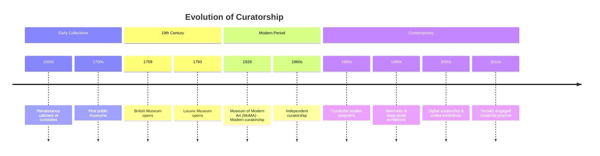

```mermaid
timeline
    title Evolution of Curatorship
    section Early Collections
        1500s : Renaissance cabinets of curiosities
        1700s : First public museums
    section 19th Century
        1759 : British Museum opens
        1793 : Louvre Museum opens
    section Modern Period
        1929 : Museum of Modern Art (MoMA) - Modern curatorship
        1960s : Independent curatorship
    section Contemporary
        1980s : Curatorial studies programs
        1990s : Biennales & large-scale exhibitions
        2000s : Digital curatorship & online exhibitions
        2010s : Socially engaged curatorial practice
```
