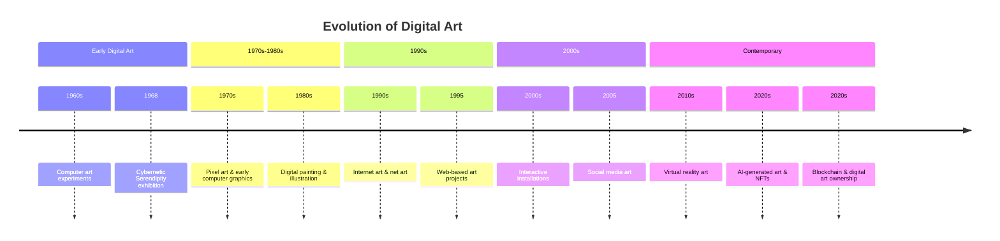

```mermaid
timeline
    title Evolution of Digital Art
    section Early Digital Art
        1960s : Computer art experiments
        1968 : Cybernetic Serendipity exhibition
    section 1970s-1980s
        1970s : Pixel art & early computer graphics
        1980s : Digital painting & illustration
    section 1990s
        1990s : Internet art & net art
        1995 : Web-based art projects
    section 2000s
        2000s : Interactive installations
        2005 : Social media art
    section Contemporary
        2010s : Virtual reality art
        2020s : AI-generated art & NFTs
        2020s : Blockchain & digital art ownership
```
