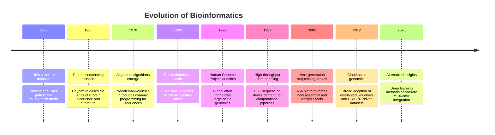

```mermaid
timeline
    title Evolution of Bioinformatics
    1953 : DNA structure resolved
          : Watson and Crick publish the double-helix model
    1965 : Protein sequencing pioneers
          : Dayhoff releases the Atlas of Protein Sequence and Structure
    1970 : Alignment algorithms emerge
          : Needleman–Wunsch introduces dynamic programming for sequences
    1982 : Public databases scale
          : GenBank becomes widely accessible online
    1990 : Human Genome Project launches
          : Global effort formalizes large-scale genomics
    1997 : High-throughput data handling
          : EST sequencing drives demand for computational pipelines
    2005 : Next-generation sequencing arrives
          : 454 platform forces new assembly and analysis tools
    2012 : Cloud-scale genomics
          : Broad adoption of distributed workflows and CRISPR-driven datasets
    2020 : AI-enabled insights
          : Deep learning methods accelerate multi-omic integration
```
