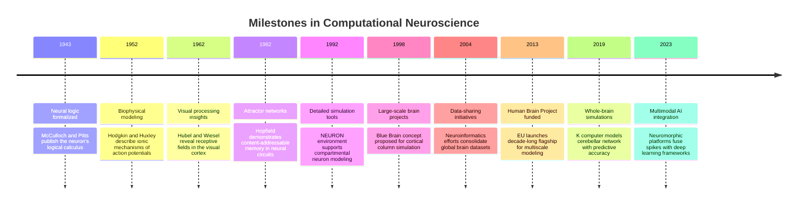

```mermaid
timeline
    title Milestones in Computational Neuroscience
    1943 : Neural logic formalized
          : McCulloch and Pitts publish the neuron's logical calculus
    1952 : Biophysical modeling
          : Hodgkin and Huxley describe ionic mechanisms of action potentials
    1962 : Visual processing insights
          : Hubel and Wiesel reveal receptive fields in the visual cortex
    1982 : Attractor networks
          : Hopfield demonstrates content-addressable memory in neural circuits
    1992 : Detailed simulation tools
          : NEURON environment supports compartmental neuron modeling
    1998 : Large-scale brain projects
          : Blue Brain concept proposed for cortical column simulation
    2004 : Data-sharing initiatives
          : Neuroinformatics efforts consolidate global brain datasets
    2013 : Human Brain Project funded
          : EU launches decade-long flagship for multiscale modeling
    2019 : Whole-brain simulations
          : K computer models cerebellar network with predictive accuracy
    2023 : Multimodal AI integration
          : Neuromorphic platforms fuse spikes with deep learning frameworks
```
