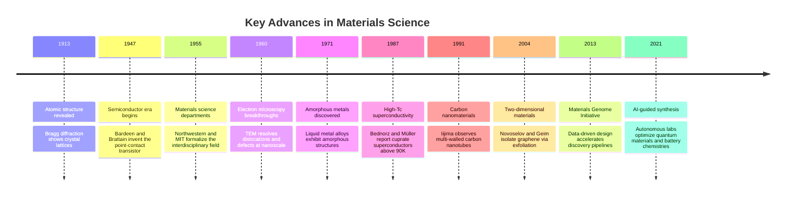

```mermaid
timeline
    title Key Advances in Materials Science
    1913 : Atomic structure revealed
          : Bragg diffraction shows crystal lattices
    1947 : Semiconductor era begins
          : Bardeen and Brattain invent the point-contact transistor
    1955 : Materials science departments
          : Northwestern and MIT formalize the interdisciplinary field
    1960 : Electron microscopy breakthroughs
          : TEM resolves dislocations and defects at nanoscale
    1971 : Amorphous metals discovered
          : Liquid metal alloys exhibit amorphous structures
    1987 : High-Tc superconductivity
          : Bednorz and Müller report cuprate superconductors above 90K
    1991 : Carbon nanomaterials
          : Iijima observes multi-walled carbon nanotubes
    2004 : Two-dimensional materials
          : Novoselov and Geim isolate graphene via exfoliation
    2013 : Materials Genome Initiative
          : Data-driven design accelerates discovery pipelines
    2021 : AI-guided synthesis
          : Autonomous labs optimize quantum materials and battery chemistries
```
