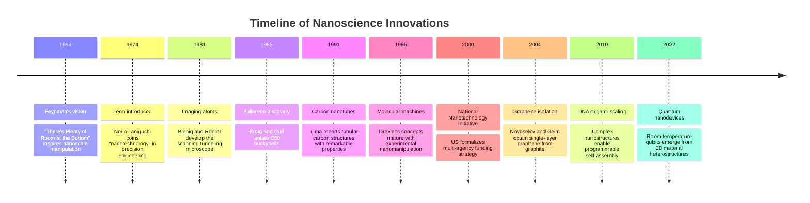

```mermaid
timeline
    title Timeline of Nanoscience Innovations
    1959 : Feynman's vision
          : "There's Plenty of Room at the Bottom" inspires nanoscale manipulation
    1974 : Term introduced
          : Norio Taniguchi coins "nanotechnology" in precision engineering
    1981 : Imaging atoms
          : Binnig and Rohrer develop the scanning tunneling microscope
    1985 : Fullerene discovery
          : Kroto and Curl isolate C60 buckyballs
    1991 : Carbon nanotubes
          : Iijima reports tubular carbon structures with remarkable properties
    1996 : Molecular machines
          : Drexler's concepts mature with experimental nanomanipulation
    2000 : National Nanotechnology Initiative
          : US formalizes multi-agency funding strategy
    2004 : Graphene isolation
          : Novoselov and Geim obtain single-layer graphene from graphite
    2010 : DNA origami scaling
          : Complex nanostructures enable programmable self-assembly
    2022 : Quantum nanodevices
          : Room-temperature qubits emerge from 2D material heterostructures
```
