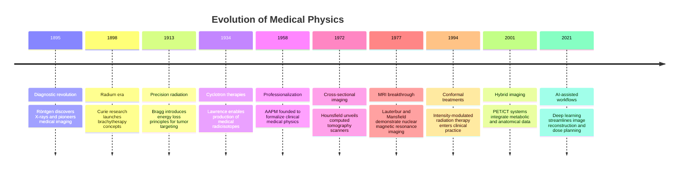

```mermaid
timeline
    title Evolution of Medical Physics
    1895 : Diagnostic revolution
          : Röntgen discovers X-rays and pioneers medical imaging
    1898 : Radium era
          : Curie research launches brachytherapy concepts
    1913 : Precision radiation
          : Bragg introduces energy loss principles for tumor targeting
    1934 : Cyclotron therapies
          : Lawrence enables production of medical radioisotopes
    1958 : Professionalization
          : AAPM founded to formalize clinical medical physics
    1972 : Cross-sectional imaging
          : Hounsfield unveils computed tomography scanners
    1977 : MRI breakthrough
          : Lauterbur and Mansfield demonstrate nuclear magnetic resonance imaging
    1994 : Conformal treatments
          : Intensity-modulated radiation therapy enters clinical practice
    2001 : Hybrid imaging
          : PET/CT systems integrate metabolic and anatomical data
    2021 : AI-assisted workflows
          : Deep learning streamlines image reconstruction and dose planning
```
