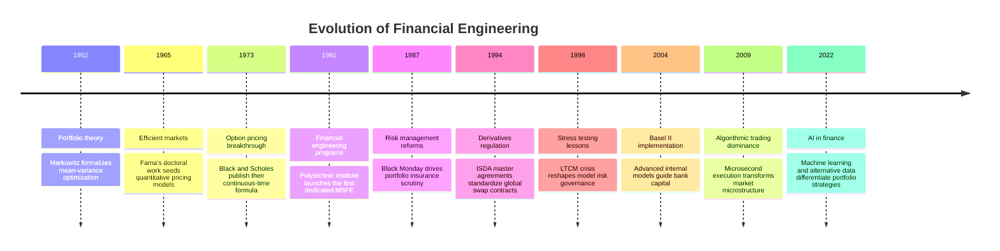

```mermaid
timeline
    title Evolution of Financial Engineering
    1952 : Portfolio theory
          : Markowitz formalizes mean-variance optimization
    1965 : Efficient markets
          : Fama's doctoral work seeds quantitative pricing models
    1973 : Option pricing breakthrough
          : Black and Scholes publish their continuous-time formula
    1981 : Financial engineering programs
          : Polytechnic Institute launches the first dedicated MSFE
    1987 : Risk management reforms
          : Black Monday drives portfolio insurance scrutiny
    1994 : Derivatives regulation
          : ISDA master agreements standardize global swap contracts
    1998 : Stress testing lessons
          : LTCM crisis reshapes model risk governance
    2004 : Basel II implementation
          : Advanced internal models guide bank capital
    2009 : Algorithmic trading dominance
          : Microsecond execution transforms market microstructure
    2022 : AI in finance
          : Machine learning and alternative data differentiate portfolio strategies
```
