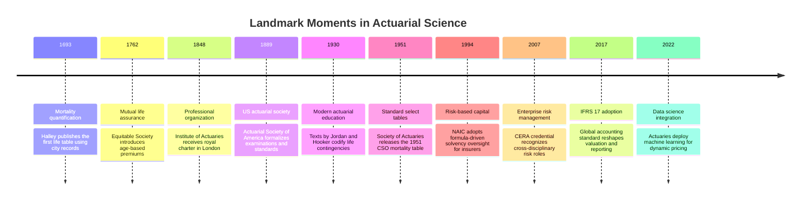

```mermaid
timeline
    title Landmark Moments in Actuarial Science
    1693 : Mortality quantification
          : Halley publishes the first life table using city records
    1762 : Mutual life assurance
          : Equitable Society introduces age-based premiums
    1848 : Professional organization
          : Institute of Actuaries receives royal charter in London
    1889 : US actuarial society
          : Actuarial Society of America formalizes examinations and standards
    1930 : Modern actuarial education
          : Texts by Jordan and Hooker codify life contingencies
    1951 : Standard select tables
          : Society of Actuaries releases the 1951 CSO mortality table
    1994 : Risk-based capital
          : NAIC adopts formula-driven solvency oversight for insurers
    2007 : Enterprise risk management
          : CERA credential recognizes cross-disciplinary risk roles
    2017 : IFRS 17 adoption
          : Global accounting standard reshapes valuation and reporting
    2022 : Data science integration
          : Actuaries deploy machine learning for dynamic pricing
```
