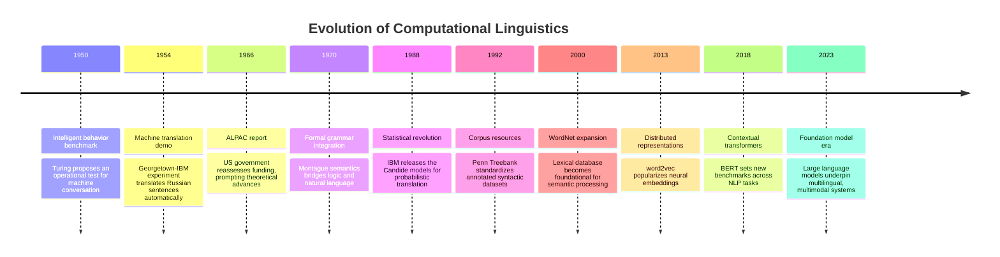

```mermaid
timeline
    title Evolution of Computational Linguistics
    1950 : Intelligent behavior benchmark
          : Turing proposes an operational test for machine conversation
    1954 : Machine translation demo
          : Georgetown-IBM experiment translates Russian sentences automatically
    1966 : ALPAC report
          : US government reassesses funding, prompting theoretical advances
    1970 : Formal grammar integration
          : Montague semantics bridges logic and natural language
    1988 : Statistical revolution
          : IBM releases the Candide models for probabilistic translation
    1992 : Corpus resources
          : Penn Treebank standardizes annotated syntactic datasets
    2000 : WordNet expansion
          : Lexical database becomes foundational for semantic processing
    2013 : Distributed representations
          : word2vec popularizes neural embeddings
    2018 : Contextual transformers
          : BERT sets new benchmarks across NLP tasks
    2023 : Foundation model era
          : Large language models underpin multilingual, multimodal systems
```
