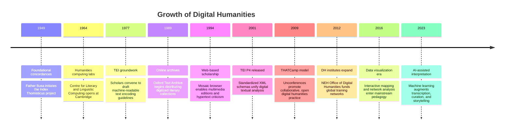

```mermaid
timeline
    title Growth of Digital Humanities
    1949 : Foundational concordances
          : Father Busa initiates the Index Thomisticus project
    1964 : Humanities computing labs
          : Centre for Literary and Linguistic Computing opens at Cambridge
    1977 : TEI groundwork
          : Scholars convene to draft machine-readable text encoding guidelines
    1989 : Online archives
          : Oxford Text Archive begins distributing digitized literary collections
    1994 : Web-based scholarship
          : Mosaic browser enables multimedia editions and hypertext criticism
    2001 : TEI P4 released
          : Standardized XML schemas unify digital textual analysis
    2009 : THATCamp model
          : Unconferences promote collaborative, open digital humanities practice
    2012 : DH institutes expand
          : NEH Office of Digital Humanities funds global training networks
    2016 : Data visualization era
          : Interactive mapping and network analysis enter mainstream pedagogy
    2023 : AI-assisted interpretation
          : Machine learning augments transcription, curation, and storytelling
```
