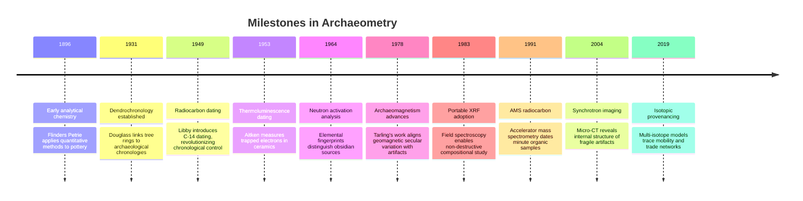

```mermaid
timeline
    title Milestones in Archaeometry
    1896 : Early analytical chemistry
          : Flinders Petrie applies quantitative methods to pottery
    1931 : Dendrochronology established
          : Douglass links tree rings to archaeological chronologies
    1949 : Radiocarbon dating
          : Libby introduces C-14 dating, revolutionizing chronological control
    1953 : Thermoluminescence dating
          : Aitken measures trapped electrons in ceramics
    1964 : Neutron activation analysis
          : Elemental fingerprints distinguish obsidian sources
    1978 : Archaeomagnetism advances
          : Tarling's work aligns geomagnetic secular variation with artifacts
    1983 : Portable XRF adoption
          : Field spectroscopy enables non-destructive compositional study
    1991 : AMS radiocarbon
          : Accelerator mass spectrometry dates minute organic samples
    2004 : Synchrotron imaging
          : Micro-CT reveals internal structure of fragile artifacts
    2019 : Isotopic provenancing
          : Multi-isotope models trace mobility and trade networks
```
