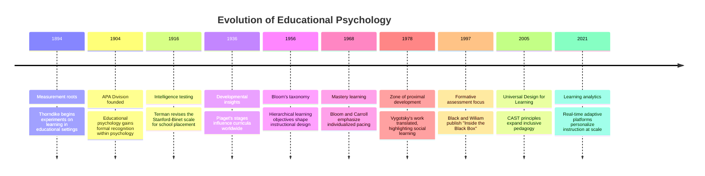

```mermaid
timeline
    title Evolution of Educational Psychology
    1894 : Measurement roots
          : Thorndike begins experiments on learning in educational settings
    1904 : APA Division founded
          : Educational psychology gains formal recognition within psychology
    1916 : Intelligence testing
          : Terman revises the Stanford-Binet scale for school placement
    1936 : Developmental insights
          : Piaget's stages influence curricula worldwide
    1956 : Bloom's taxonomy
          : Hierarchical learning objectives shape instructional design
    1968 : Mastery learning
          : Bloom and Carroll emphasize individualized pacing
    1978 : Zone of proximal development
          : Vygotsky's work translated, highlighting social learning
    1997 : Formative assessment focus
          : Black and Wiliam publish "Inside the Black Box"
    2005 : Universal Design for Learning
          : CAST principles expand inclusive pedagogy
    2021 : Learning analytics
          : Real-time adaptive platforms personalize instruction at scale
```
