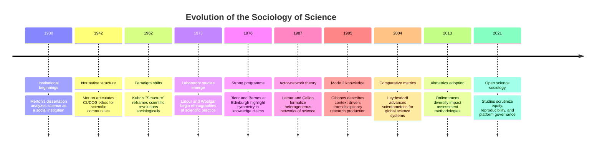

```mermaid
timeline
    title Evolution of the Sociology of Science
    1938 : Institutional beginnings
          : Merton's dissertation analyzes science as a social institution
    1942 : Normative structure
          : Merton articulates CUDOS ethos for scientific communities
    1962 : Paradigm shifts
          : Kuhn's "Structure" reframes scientific revolutions sociologically
    1973 : Laboratory studies emerge
          : Latour and Woolgar begin ethnographies of scientific practice
    1976 : Strong programme
          : Bloor and Barnes at Edinburgh highlight symmetry in knowledge claims
    1987 : Actor-network theory
          : Latour and Callon formalize heterogeneous networks of science
    1995 : Mode 2 knowledge
          : Gibbons describes context-driven, transdisciplinary research production
    2004 : Comparative metrics
          : Leydesdorff advances scientometrics for global science systems
    2013 : Altmetrics adoption
          : Online traces diversify impact assessment methodologies
    2021 : Open science sociology
          : Studies scrutinize equity, reproducibility, and platform governance
```
