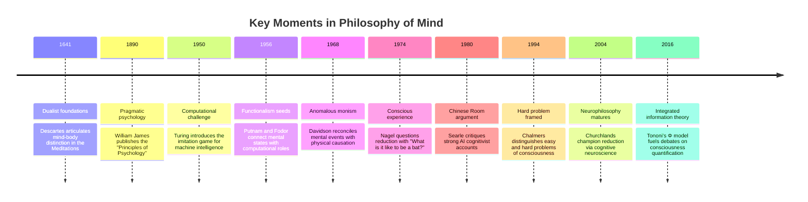

```mermaid
timeline
    title Key Moments in Philosophy of Mind
    1641 : Dualist foundations
          : Descartes articulates mind-body distinction in the Meditations
    1890 : Pragmatic psychology
          : William James publishes the "Principles of Psychology"
    1950 : Computational challenge
          : Turing introduces the imitation game for machine intelligence
    1956 : Functionalism seeds
          : Putnam and Fodor connect mental states with computational roles
    1968 : Anomalous monism
          : Davidson reconciles mental events with physical causation
    1974 : Conscious experience
          : Nagel questions reduction with "What is it like to be a bat?"
    1980 : Chinese Room argument
          : Searle critiques strong AI cognitivist accounts
    1994 : Hard problem framed
          : Chalmers distinguishes easy and hard problems of consciousness
    2004 : Neurophilosophy matures
          : Churchlands champion reduction via cognitive neuroscience
    2016 : Integrated information theory
          : Tononi's Φ model fuels debates on consciousness quantification
```
