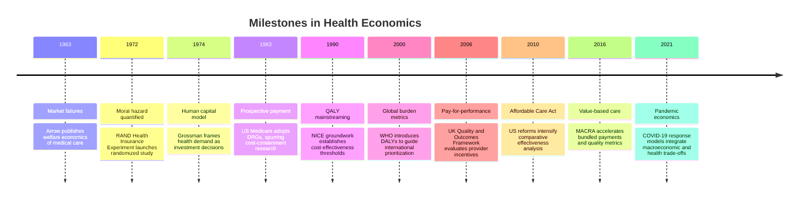

```mermaid
timeline
    title Milestones in Health Economics
    1963 : Market failures
          : Arrow publishes welfare economics of medical care
    1972 : Moral hazard quantified
          : RAND Health Insurance Experiment launches randomized study
    1974 : Human capital model
          : Grossman frames health demand as investment decisions
    1983 : Prospective payment
          : US Medicare adopts DRGs, spurring cost-containment research
    1990 : QALY mainstreaming
          : NICE groundwork establishes cost-effectiveness thresholds
    2000 : Global burden metrics
          : WHO introduces DALYs to guide international prioritization
    2006 : Pay-for-performance
          : UK Quality and Outcomes Framework evaluates provider incentives
    2010 : Affordable Care Act
          : US reforms intensify comparative effectiveness analysis
    2016 : Value-based care
          : MACRA accelerates bundled payments and quality metrics
    2021 : Pandemic economics
          : COVID-19 response models integrate macroeconomic and health trade-offs
```
