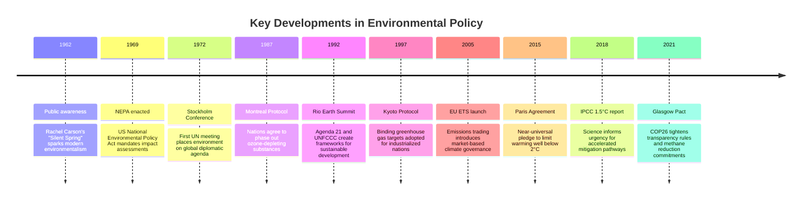

```mermaid
timeline
    title Key Developments in Environmental Policy
    1962 : Public awareness
          : Rachel Carson's "Silent Spring" sparks modern environmentalism
    1969 : NEPA enacted
          : US National Environmental Policy Act mandates impact assessments
    1972 : Stockholm Conference
          : First UN meeting places environment on global diplomatic agenda
    1987 : Montreal Protocol
          : Nations agree to phase out ozone-depleting substances
    1992 : Rio Earth Summit
          : Agenda 21 and UNFCCC create frameworks for sustainable development
    1997 : Kyoto Protocol
          : Binding greenhouse gas targets adopted for industrialized nations
    2005 : EU ETS launch
          : Emissions trading introduces market-based climate governance
    2015 : Paris Agreement
          : Near-universal pledge to limit warming well below 2°C
    2018 : IPCC 1.5°C report
          : Science informs urgency for accelerated mitigation pathways
    2021 : Glasgow Pact
          : COP26 tightens transparency rules and methane reduction commitments
```
