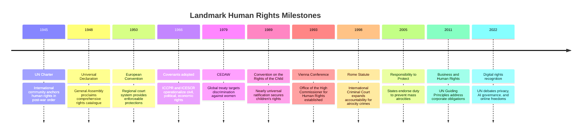

```mermaid
timeline
    title Landmark Human Rights Milestones
    1945 : UN Charter
          : International community anchors human rights in post-war order
    1948 : Universal Declaration
          : General Assembly proclaims comprehensive rights catalogue
    1950 : European Convention
          : Regional court system provides enforceable protections
    1966 : Covenants adopted
          : ICCPR and ICESCR operationalize civil, political, economic rights
    1979 : CEDAW
          : Global treaty targets discrimination against women
    1989 : Convention on the Rights of the Child
          : Nearly universal ratification secures children's rights
    1993 : Vienna Conference
          : Office of the High Commissioner for Human Rights established
    1998 : Rome Statute
          : International Criminal Court expands accountability for atrocity crimes
    2005 : Responsibility to Protect
          : States endorse duty to prevent mass atrocities
    2011 : Business and Human Rights
          : UN Guiding Principles address corporate obligations
    2022 : Digital rights recognition
          : UN debates privacy, AI governance, and online freedoms
```
