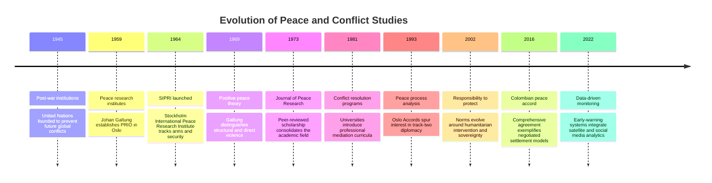

```mermaid
timeline
    title Evolution of Peace and Conflict Studies
    1945 : Post-war institutions
          : United Nations founded to prevent future global conflicts
    1959 : Peace research institutes
          : Johan Galtung establishes PRIO in Oslo
    1964 : SIPRI launched
          : Stockholm International Peace Research Institute tracks arms and security
    1969 : Positive peace theory
          : Galtung distinguishes structural and direct violence
    1973 : Journal of Peace Research
          : Peer-reviewed scholarship consolidates the academic field
    1981 : Conflict resolution programs
          : Universities introduce professional mediation curricula
    1993 : Peace process analysis
          : Oslo Accords spur interest in track-two diplomacy
    2002 : Responsibility to protect
          : Norms evolve around humanitarian intervention and sovereignty
    2016 : Colombian peace accord
          : Comprehensive agreement exemplifies negotiated settlement models
    2022 : Data-driven monitoring
          : Early-warning systems integrate satellite and social media analytics
```
