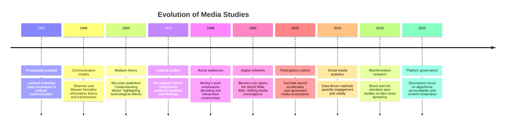

```mermaid
timeline
    title Evolution of Media Studies
    1922 : Propaganda analysis
          : Lasswell examines mass persuasion in political communication
    1948 : Communication models
          : Shannon and Weaver formalize information theory and transmission
    1964 : Medium theory
          : McLuhan publishes "Understanding Media" highlighting technological effects
    1973 : Cultural studies
          : Birmingham Centre foregrounds audience reception and ideology
    1988 : Active audiences
          : Morley's work emphasizes decoding and interpretive communities
    1991 : Digital networks
          : Berners-Lee opens the World Wide Web, shifting media convergence
    2005 : Participatory culture
          : YouTube launch accelerates user-generated media ecosystems
    2010 : Social media analytics
          : Data-driven methods quantify engagement and virality
    2016 : Misinformation research
          : Brexit and US elections spur studies on fake news dynamics
    2022 : Platform governance
          : Discussions focus on algorithmic accountability and content moderation
```
