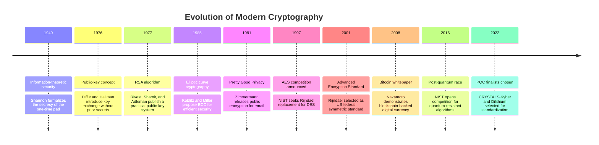

```mermaid
timeline
    title Evolution of Modern Cryptography
    1949 : Information-theoretic security
          : Shannon formalizes the secrecy of the one-time pad
    1976 : Public-key concept
          : Diffie and Hellman introduce key exchange without prior secrets
    1977 : RSA algorithm
          : Rivest, Shamir, and Adleman publish a practical public-key system
    1985 : Elliptic curve cryptography
          : Koblitz and Miller propose ECC for efficient security
    1991 : Pretty Good Privacy
          : Zimmermann releases public encryption for email
    1997 : AES competition announced
          : NIST seeks Rijndael replacement for DES
    2001 : Advanced Encryption Standard
          : Rijndael selected as US federal symmetric standard
    2008 : Bitcoin whitepaper
          : Nakamoto demonstrates blockchain-backed digital currency
    2016 : Post-quantum race
          : NIST opens competition for quantum-resistant algorithms
    2022 : PQC finalists chosen
          : CRYSTALS-Kyber and Dilithium selected for standardization
```
