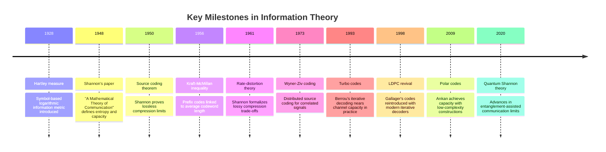

```mermaid
timeline
    title Key Milestones in Information Theory
    1928 : Hartley measure
          : Symbol-based logarithmic information metric introduced
    1948 : Shannon's paper
          : "A Mathematical Theory of Communication" defines entropy and capacity
    1950 : Source coding theorem
          : Shannon proves lossless compression limits
    1956 : Kraft-McMillan inequality
          : Prefix codes linked to average codeword length
    1961 : Rate-distortion theory
          : Shannon formalizes lossy compression trade-offs
    1973 : Wyner-Ziv coding
          : Distributed source coding for correlated signals
    1993 : Turbo codes
          : Berrou's iterative decoding nears channel capacity in practice
    1998 : LDPC revival
          : Gallager's codes reintroduced with modern iterative decoders
    2009 : Polar codes
          : Arıkan achieves capacity with low-complexity constructions
    2020 : Quantum Shannon theory
          : Advances in entanglement-assisted communication limits
```
