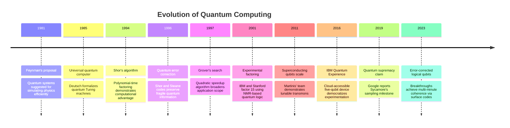

```mermaid
timeline
    title Evolution of Quantum Computing
    1981 : Feynman's proposal
          : Quantum systems suggested for simulating physics efficiently
    1985 : Universal quantum computer
          : Deutsch formalizes quantum Turing machines
    1994 : Shor's algorithm
          : Polynomial-time factoring demonstrates computational advantage
    1996 : Quantum error correction
          : Shor and Steane codes preserve fragile quantum information
    1997 : Grover's search
          : Quadratic speedup algorithm broadens application scope
    2001 : Experimental factoring
          : IBM and Stanford factor 15 using NMR-based quantum logic
    2011 : Superconducting qubits scale
          : Martinis' team demonstrates tunable transmons
    2016 : IBM Quantum Experience
          : Cloud-accessible five-qubit device democratizes experimentation
    2019 : Quantum supremacy claim
          : Google reports Sycamore's sampling milestone
    2023 : Error-corrected logical qubits
          : Breakthroughs achieve multi-minute coherence via surface codes
```
