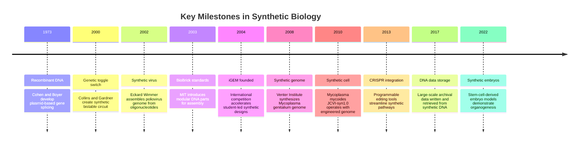

```mermaid
timeline
    title Key Milestones in Synthetic Biology
    1973 : Recombinant DNA
          : Cohen and Boyer develop plasmid-based gene splicing
    2000 : Genetic toggle switch
          : Collins and Gardner create synthetic bistable circuit
    2002 : Synthetic virus
          : Eckard Wimmer assembles poliovirus genome from oligonucleotides
    2003 : BioBrick standards
          : MIT introduces modular DNA parts for assembly
    2004 : iGEM founded
          : International competition accelerates student-led synthetic designs
    2008 : Synthetic genome
          : Venter Institute synthesizes Mycoplasma genitalium genome
    2010 : Synthetic cell
          : Mycoplasma mycoides JCVI-syn1.0 operates with engineered genome
    2013 : CRISPR integration
          : Programmable editing tools streamline synthetic pathways
    2017 : DNA data storage
          : Large-scale archival data written and retrieved from synthetic DNA
    2022 : Synthetic embryos
          : Stem-cell-derived embryo models demonstrate organogenesis
```
