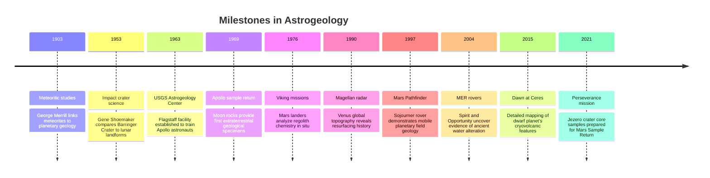

```mermaid
timeline
    title Milestones in Astrogeology
    1903 : Meteoritic studies
          : George Merrill links meteorites to planetary geology
    1953 : Impact crater science
          : Gene Shoemaker compares Barringer Crater to lunar landforms
    1963 : USGS Astrogeology Center
          : Flagstaff facility established to train Apollo astronauts
    1969 : Apollo sample return
          : Moon rocks provide first extraterrestrial geological specimens
    1976 : Viking missions
          : Mars landers analyze regolith chemistry in situ
    1990 : Magellan radar
          : Venus global topography reveals resurfacing history
    1997 : Mars Pathfinder
          : Sojourner rover demonstrates mobile planetary field geology
    2004 : MER rovers
          : Spirit and Opportunity uncover evidence of ancient water alteration
    2015 : Dawn at Ceres
          : Detailed mapping of dwarf planet's cryovolcanic features
    2021 : Perseverance mission
          : Jezero crater core samples prepared for Mars Sample Return
```
