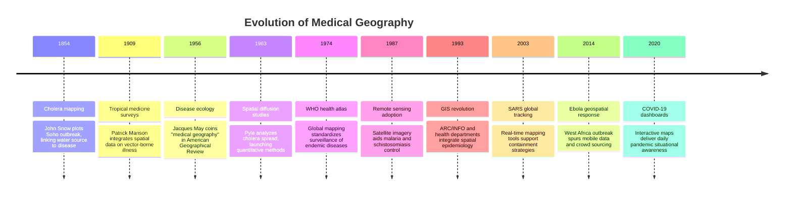

```mermaid
timeline
    title Evolution of Medical Geography
    1854 : Cholera mapping
          : John Snow plots Soho outbreak, linking water source to disease
    1909 : Tropical medicine surveys
          : Patrick Manson integrates spatial data on vector-borne illness
    1956 : Disease ecology
          : Jacques May coins "medical geography" in American Geographical Review
    1963 : Spatial diffusion studies
          : Pyle analyzes cholera spread, launching quantitative methods
    1974 : WHO health atlas
          : Global mapping standardizes surveillance of endemic diseases
    1987 : Remote sensing adoption
          : Satellite imagery aids malaria and schistosomiasis control
    1993 : GIS revolution
          : ARC/INFO and health departments integrate spatial epidemiology
    2003 : SARS global tracking
          : Real-time mapping tools support containment strategies
    2014 : Ebola geospatial response
          : West Africa outbreak spurs mobile data and crowd sourcing
    2020 : COVID-19 dashboards
          : Interactive maps deliver daily pandemic situational awareness
```
