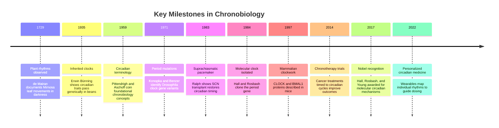

```mermaid
timeline
    title Key Milestones in Chronobiology
    1729 : Plant rhythms observed
          : de Mairan documents Mimosa leaf movements in darkness
    1935 : Inherited clocks
          : Erwin Bünning shows circadian traits pass genetically in beans
    1959 : Circadian terminology
          : Pittendrigh and Aschoff coin foundational chronobiology concepts
    1971 : Period mutations
          : Konopka and Benzer identify Drosophila clock gene variants
    1983 : Suprachiasmatic pacemaker
          : Ralph shows SCN transplant restores circadian timing
    1984 : Molecular clock isolated
          : Hall and Rosbash clone the period gene
    1997 : Mammalian clockwork
          : CLOCK and BMAL1 proteins described in mice
    2014 : Chronotherapy trials
          : Cancer treatments timed to circadian cycles improve outcomes
    2017 : Nobel recognition
          : Hall, Rosbash, and Young awarded for molecular circadian mechanisms
    2022 : Personalized circadian medicine
          : Wearables map individual rhythms to guide dosing
```
