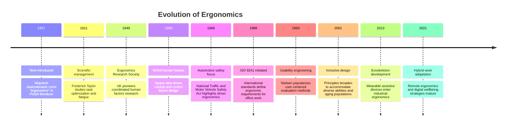

```mermaid
timeline
    title Evolution of Ergonomics
    1857 : Term introduced
          : Wojciech Jastrzebowski coins "ergonomics" in Polish literature
    1911 : Scientific management
          : Frederick Taylor studies task optimization and fatigue
    1949 : Ergonomics Research Society
          : UK pioneers coordinated human factors research
    1958 : NASA human factors
          : Space race drives cockpit and control layout design
    1966 : Automotive safety focus
          : National Traffic and Motor Vehicle Safety Act highlights driver ergonomics
    1988 : ISO 9241 initiated
          : International standards define ergonomic requirements for office work
    1993 : Usability engineering
          : Nielsen popularizes user-centered evaluation methods
    2001 : Inclusive design
          : Principles broaden to accommodate diverse abilities and aging populations
    2013 : Exoskeleton development
          : Wearable assistive devices enter industrial ergonomics
    2021 : Hybrid work adaptation
          : Remote ergonomics and digital wellbeing strategies mature
```
