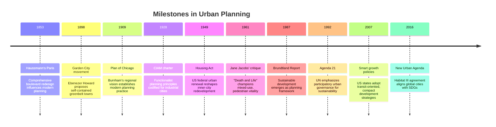

```mermaid
timeline
    title Milestones in Urban Planning
    1853 : Haussmann's Paris
          : Comprehensive boulevard redesign influences modern planning
    1898 : Garden City movement
          : Ebenezer Howard proposes self-contained greenbelt towns
    1909 : Plan of Chicago
          : Burnham's regional vision establishes modern planning practice
    1928 : CIAM charter
          : Functionalist planning principles codified for industrial cities
    1949 : Housing Act
          : US federal urban renewal reshapes inner-city redevelopment
    1961 : Jane Jacobs' critique
          : "Death and Life" champions mixed-use, pedestrian vitality
    1987 : Brundtland Report
          : Sustainable development emerges as planning framework
    1992 : Agenda 21
          : UN emphasizes participatory urban governance for sustainability
    2007 : Smart growth policies
          : US states adopt transit-oriented, compact development strategies
    2016 : New Urban Agenda
          : Habitat III agreement aligns global cities with SDGs
```
