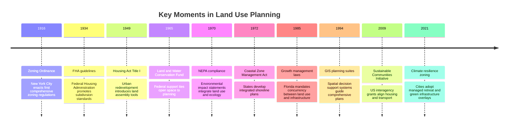

```mermaid
timeline
    title Key Moments in Land Use Planning
    1916 : Zoning Ordinance
          : New York City enacts first comprehensive zoning regulations
    1934 : FHA guidelines
          : Federal Housing Administration promotes subdivision standards
    1949 : Housing Act Title I
          : Urban redevelopment introduces land assembly tools
    1965 : Land and Water Conservation Fund
          : Federal support ties open space to planning
    1970 : NEPA compliance
          : Environmental impact statements integrate land use and ecology
    1972 : Coastal Zone Management Act
          : States develop integrated shoreline plans
    1985 : Growth management laws
          : Florida mandates concurrency between land use and infrastructure
    1994 : GIS planning suites
          : Spatial decision support systems guide comprehensive plans
    2009 : Sustainable Communities Initiative
          : US interagency grants align housing and transport
    2021 : Climate resilience zoning
          : Cities adopt managed retreat and green infrastructure overlays
```
