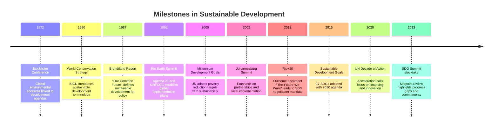

```mermaid
timeline
    title Milestones in Sustainable Development
    1972 : Stockholm Conference
          : Global environmental concerns linked to development agendas
    1980 : World Conservation Strategy
          : IUCN introduces sustainable development terminology
    1987 : Brundtland Report
          : "Our Common Future" defines sustainable development for policy
    1992 : Rio Earth Summit
          : Agenda 21 and UNFCCC establish global implementation plans
    2000 : Millennium Development Goals
          : UN adopts poverty reduction targets with sustainability
    2002 : Johannesburg Summit
          : Emphasis on partnerships and local implementation
    2012 : Rio+20
          : Outcome document "The Future We Want" leads to SDG negotiation mandate
    2015 : Sustainable Development Goals
          : 17 SDGs adopted with 2030 agenda
    2020 : UN Decade of Action
          : Acceleration calls focus on financing and innovation
    2023 : SDG Summit stocktake
          : Midpoint review highlights progress gaps and commitments
```
